# Xamarin.Forms Duolingo App Clone

Um clone do Duolingo feito com Xamarin.Forms. Este app está sendo desenvolvido em live streams que ocorrem semanalmente. Estas lives estão sendo transmitidas pelo [Youtube](https://www.youtube.com/channel/UCD_Cgiqajwi-u-n3lYvp8Ig), [Twitch](https://www.twitch.tv/ionixjunior) e [Periscope](https://www.periscope.tv/ionixjunior).

Para quem prefere Youtube, criei uma [playlist com todas as lives do clone do Duolingo com Xamarin.Forms](https://www.youtube.com/playlist?list=PL6M6J_6V_um9tuXHl-Tq-T1qmiuxu3AM9).

## Screenshots

### Android

#### Tela de lições
<kbd>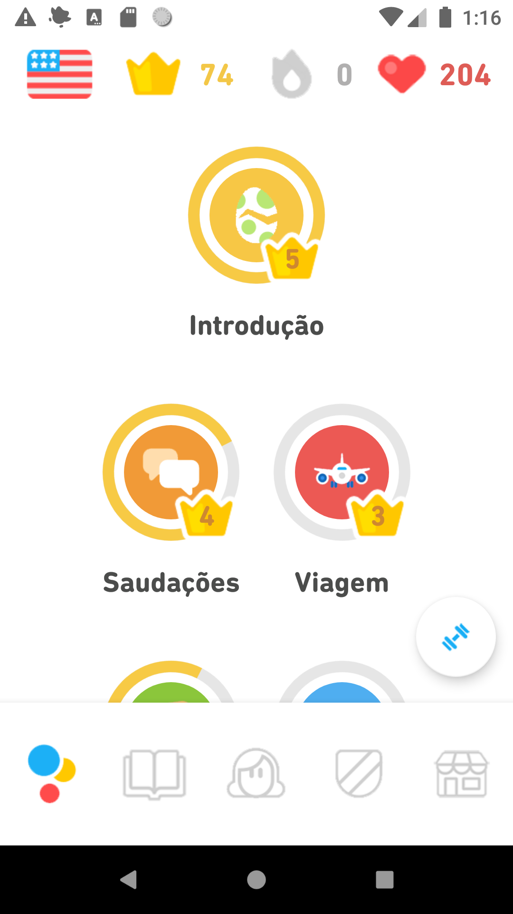</kbd>
<kbd>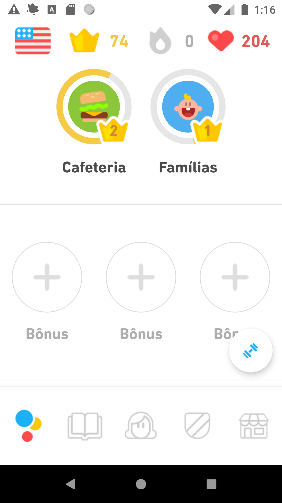</kbd>
<kbd>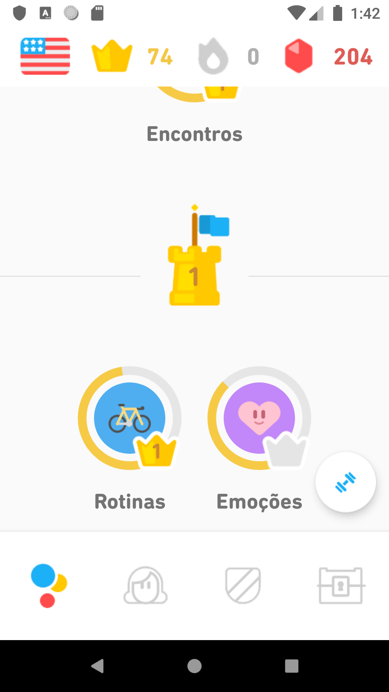</kbd>

#### Tela do perfil
<kbd>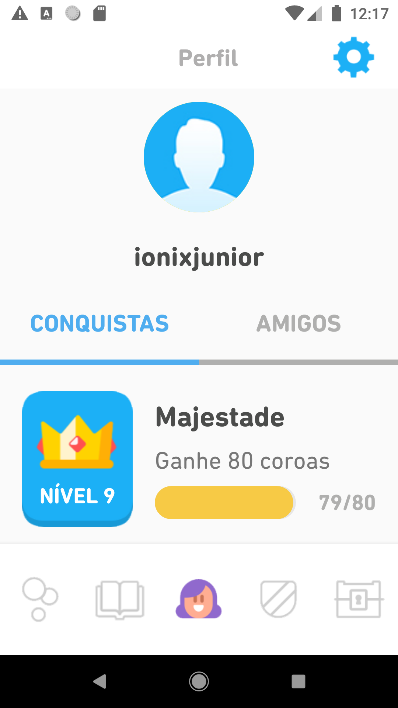</kbd>
<kbd>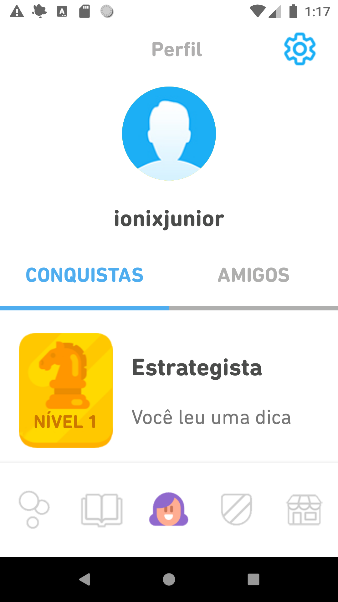</kbd>
<kbd></kbd>
<kbd>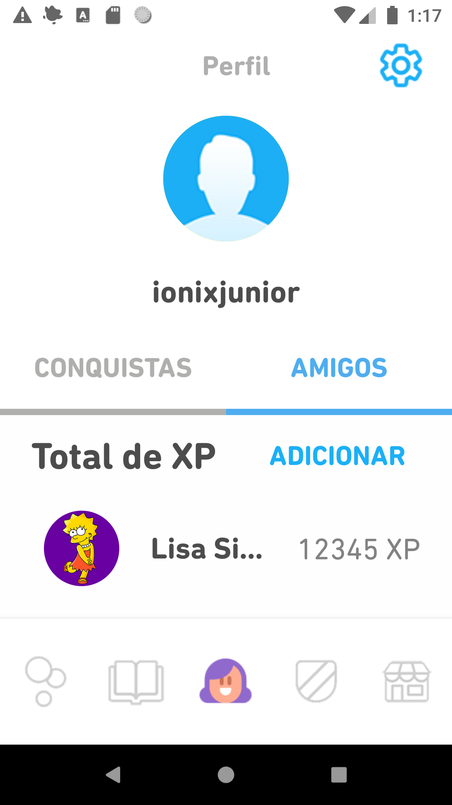</kbd>

### iOS

#### Tela de lições
<kbd>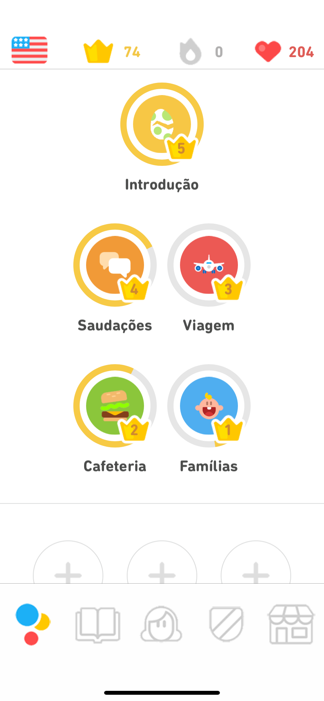</kbd>
<kbd>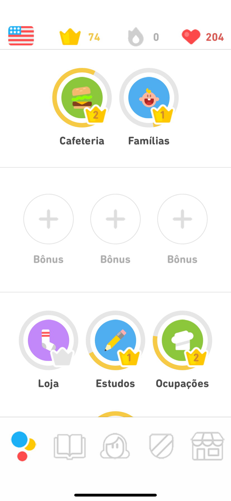</kbd>
<kbd></kbd>

#### Tela do perfil
<kbd>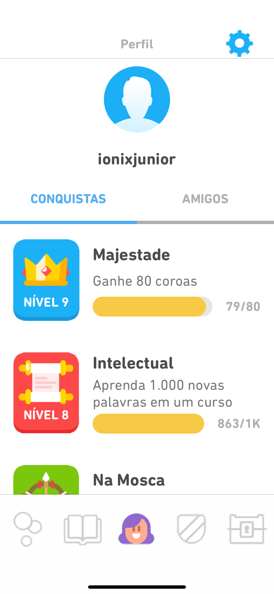</kbd>
<kbd>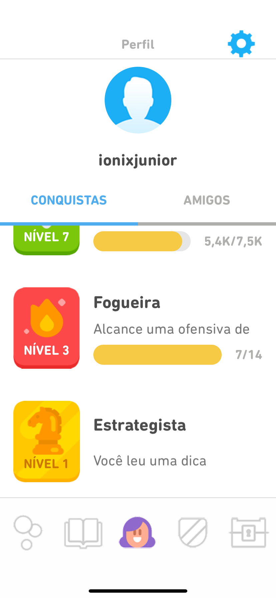</kbd>
<kbd>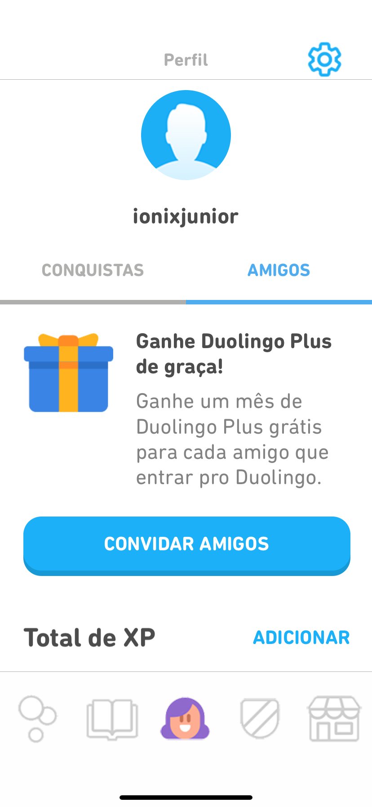</kbd>
<kbd>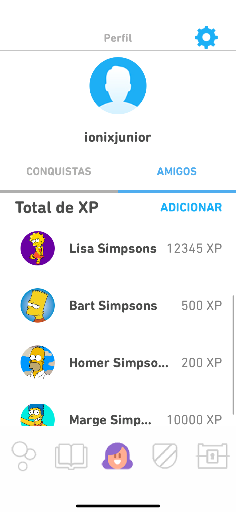</kbd>